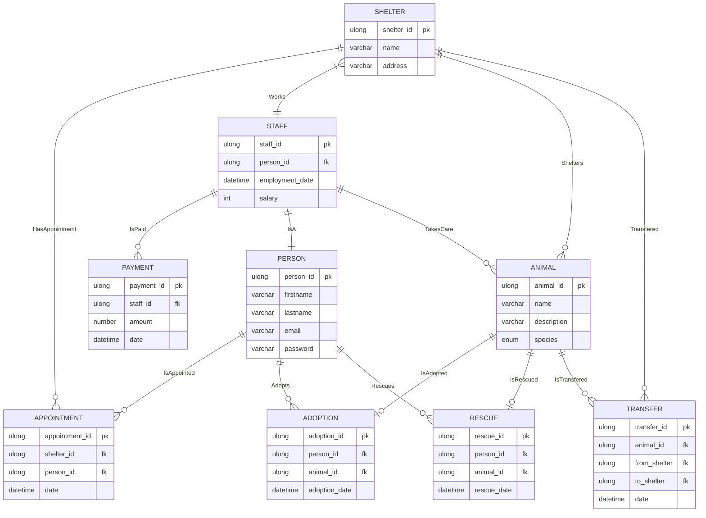

# PAO2025

# Dog and Cat Shelter 

I'll be making a java project that handles the operations of an animal shelter. 

Users (Staff Members) will be able to do the following actions:

- Get a list of all the animals rescued in a specific shelter
- Get a list of all the animals that aren't adopted yet
- Get a list of all the employees in a specific shelter
- Get a list of all the people who have rescued animals
- Get a list of all appointments in a specific shelter
- Add a new person or staff member
- Assign a pet to a staff member
- Add a new rescue
- Add a new adoption
- Add a new appointment
  

