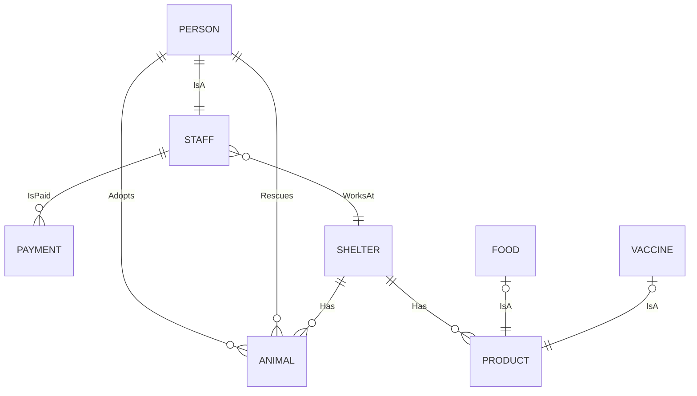

# Proiect PAO 2025

[cerintele proiectului](https://github.com/deeas/PAO-2025/blob/master/Programare%20avansata%20pe%20obiecte%20-%20proiect%202025.pdf)

# Adapost de Animale  

Am facut un proiect in Java ce modeleaza un adapost de animale. 

Se pot apela urmatoarele servicii:

1. O persoana aduce un animal de pe strada la adapost 
2. O persoana adopta un animal de la adapost 
3. O persoana cumpara un produs (mancare sau vaccin) de la adapost
4. Un adapost se aprovizioneaza cu un nou produs
5. Se obtine o lista cu toate animalele dintr-un adapost
6. Se obtine o lista sortata a platilor catre un angajat 
7. Se verifica daca un produs este mancare sau nu 
8. O persoana este angajata la adapost
9. Se plateste salariul unui angajat
10. Se obtin toate animalele dintr-o anumita specie
  

